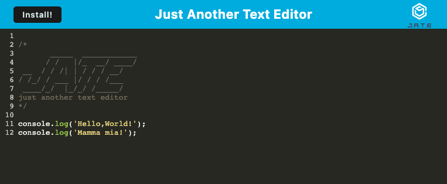
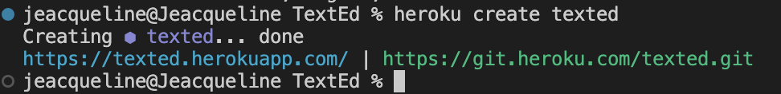
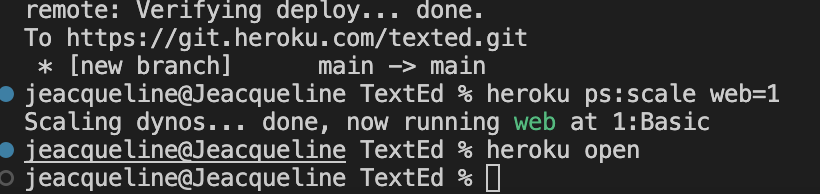

# TextEd
This is a progressive web application (PWA) that allows you to write and edit text in the browser, even without an internet connection. In addition, the application uses data persistence techniques to make sure that your data is always available, even if the browser does not support one of the options.

## Challenge 19
The following resources were used as a guide for the realization of this application: 
- TDM-VIRT-FSF-PT-10-2022-U-LOLC/19-PWA/01-Activities/28-Stu_Mini-Project,24,26,21,25
- https://www.npmjs.com/package/webpack-pwa-manifest 
- https://snyk.io/advisor/npm-package/workbox-webpack-plugin/functions/workbox-webpack-plugin.InjectManifest
## User Story

```md
AS A developer
I WANT to create notes or code snippets with or without an internet connection
SO THAT I can reliably retrieve them for later use
```

## Acceptance Criteria

```md
GIVEN a text editor web application
WHEN I open my application in my editor
THEN I should see a client server folder structure
WHEN I run `npm run start` from the root directory
THEN I find that my application should start up the backend and serve the client
WHEN I run the text editor application from my terminal
THEN I find that my JavaScript files have been bundled using webpack
WHEN I run my webpack plugins
THEN I find that I have a generated HTML file, service worker, and a manifest file
WHEN I use next-gen JavaScript in my application
THEN I find that the text editor still functions in the browser without errors
WHEN I open the text editor
THEN I find that IndexedDB has immediately created a database storage
WHEN I enter content and subsequently click off of the DOM window
THEN I find that the content in the text editor has been saved with IndexedDB
WHEN I reopen the text editor after closing it
THEN I find that the content in the text editor has been retrieved from our IndexedDB
WHEN I click on the Install button
THEN I download my web application as an icon on my desktop
WHEN I load my web application
THEN I should have a registered service worker using workbox
WHEN I register a service worker
THEN I should have my static assets pre cached upon loading along with subsequent pages and static assets
WHEN I deploy to Heroku
THEN I should have proper build scripts for a webpack application
```

## Features
* Basic text editor in the browser.
* Works as a single page app.
* PWA compatible.
* Works offline.
* Deployed with Heroku.

## Installation
- The app runs in the browser, so there is no need to install anything. Simply visit the URL of the app in your browser and you will be able to use it.
* or if you want to prove it in your localhost
- you need to clone this repo into your laptop
- then open VS Code,
- open the terminal,
- type npm install 
- npm run build
- npm run start
- go to your browser and write: localhost:3000







[GitHub/Jeacqueline TextEd](https://github.com/Jeacqueline/TextEd)

[Heroku/Jeacqueline TextEd](https://texted.herokuapp.com/)
